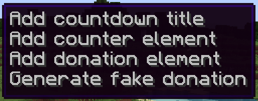
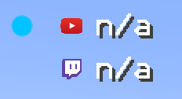
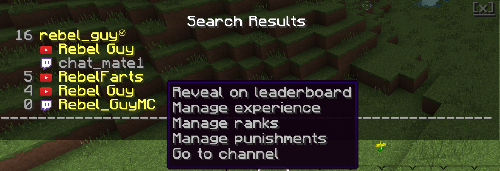
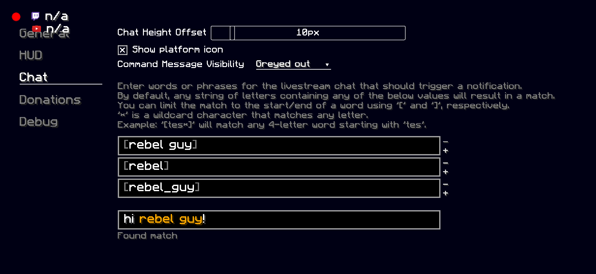

See [here](interactive-screen.md) for a more technical description of how the ChatMate UI works.

# ChatMate Dashboard
Most administrative actions are conducted via the ChatMate Dashboard. It is accessible via the Forge mod list or directly via the Minecraft pause menu. The streamer should first log in to their registered ChatMate account in the Dashboard's General page to unlock all features. Only then does ChatMate listen for new livestream messages, events, and allows the streamer to manager their data.

# ChatMate HUD
The HUD is a screen overlay for displaying HUD elements. The elements' layout and content is completely customisable by the user via the ChatMate HUD Screen. The HUD screen can be accessed by pressing `Y` (configurable keybinding) and closed by pressing `ESC`. Right clicking the HUD screen will bring up the HUD context menu:

When hovering over a HUD element, a grey box will appear indicating that the element can be interacted with. Dragging the element across the screen will translate its position, while scrolling the mouse wheel will resize it. Furthermore, elements can be multi-selected by holding shift and clicking on multiple elements to toggle their selection. Any transformation will then be applied to all elements within the selection.

ChatMate saves the layout of status-related HUD elements relative to the Minecraft window and attempts to restore the positions upon startup.

The status indicator can be in 4 states:
- Red: Can't connect to the ChatMate server.
- Dark blue: Connection to the server established, but no livestream has been set.
- Cyan: Livestream has been set, but is not currently live.
- Green: Livestream is live.

The donation HUD element presents a number of options for overlaying donation stats onto the screen. If ChatMate has been configured to listen to donations via Streamlabs, the stats will update in real-time as donations are received.

# Chat Features
Any user names printed by ChatMate in the Minecraft chat window are interactive (indicated by the question mark icon next to the mouse cursor when hovering over the name). Right-clicking a user brings up the user context menu, from which several more options can be accessed (see screenshot below).

## User Management
Streamers can search for registered usernames or YouTube/Twitch channel names via the command `/cm search <query>`. Only users that have participated in the logged-in streamer's livestreams will be included in the search. In the results, ChatMate will present all linked channels of any matched user that has linked channels, grouped by registered user (indicated by the checkmark next to the name). Yellow names indicate that the name matched the query directly, while grey names indicate connected channels which did not match the query. The platform to which a channel belongs to is identified by the platform icon.

The search functionality provides a consistent way for streamers to view or manage a particular user, even if not running an active livestream or even if the user is not currently present.

## Leaderboard
The chat experience leaderboard compares viewers' chat levels. The full leaderboard of all of the streamers' viewers can be accessed via the `/cm ranks` command. A partial leaderboard can be accessed by right-clicking on a user and selecting the "Reveal on leaderboard" option.

## Chat Mentions
Streamers can define words that, when sent by a viewer in the Youtube/Twitch chat, will trigger a chat-mention notification. The notification highlights the matched text in orange and is accompanied by a "ding" sound. The filter can be edited and tested on the Dashboard -> Chat screen:

## UX
ChatMate modifies the Minecraft chat window to allow for smooth scrolling for a more pleasant user experience, and also keeps track of a longer chat history than vanilla Minecraft. Right-clicking on any message brings up the option to delete that message from the chat window. In the future, more chat functionality will be added, such as the ability to search for keywords, view timestamps, filter messages by user, or persist the chat log.

# Ranks
Every user participating in the livestream is given an implicit `VIEWER` rank which is purely cosmetic. If a user is assigned one or more actual ChatMate ranks, the rank at the top of the hierarchy will be displayed. The rank hierarchy is approximately ordered according to permissions or prestige associated with the rank. In the future, streamers will be able to customise the rank hierarchy.

Clicking on "Manage ranks" or "Manage punishments" will bring up the user's rank modal. Here, all current and historic (for punishments) ranks are listed. Clicking on any item will bring up more details about the rank, including the option to revoke it, if currently active. Applying or revoking ranks with external side effects (`mod`, `ban`, and `timeout` ranks) will further display the result of applying/revoking the rank externally for each channel. Hovering over the status displays more information, such as the error message that was encountered.

# Persistence
There are two types of persistent data in the Client.

Logs are stored in the `./minecraft/mods/ChatMate/logs/` folder. The level of logging is configurable within the [ChatMate Dashboard](#chatmate-dashboard).

User settings are stored in the `./minecraft/mods/ChatMate/config.json` file. 
