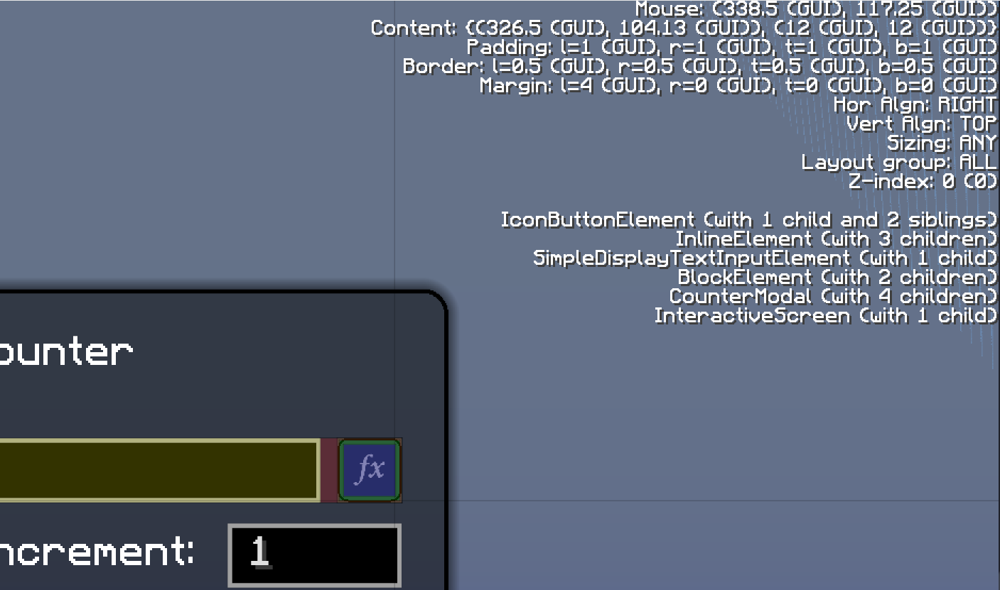

The (somewhat unfortunately named) Interactive Screen and Interactive Elements form a rich ecosystem of completely custom UI elements, featuring interactivity, maintainability, and extensibility which the existing Forge UI elements mostly lack. Heavily inspired by HTML and related technologies, working with the ChatMate Interactive UI should feel familiar and reasonably intuitive for those who have previously worked with web development.

One of the main features of the Interactive ecosystem is the dynamic [layout engine](#layout-engine). Each UI element can have assigned to it a number of layout properties which determine its size, position, and behaviour relative to parents, siblings, or children elements. These properties can be statically defined or dynamically changed - the layout engine attempts to size and position all elements on the Screen to satisfy all constraints and requirements, responding in real time to updates to these constraints and requirements.

# `IElement`s
An Interactive Element is defined by the `IElement` interface, whose parent and optional children are also `IElement`s. The `InteractiveScreen` is a special element and always the top-most parent. Together, the hierarchy of elements form the element tree.

It is straightforward to create reusable elements akin to React (or similar frameworks') components. In fact, just like React (class) components, Interactive Elements specify the content to render in the `render()` method. A default implementation of the `IElement` interface is provided by the `ElementBase` class. It provides hooks for [user interaction events](#events), cursor/pointer management, state management, and some related helper methods. Generally, all elements should extend the `ElementBase` class, except in special cases.

In each frame, the rendering engine calls the `render()` method of each visible element. Note that all low-level rendering is [deferred on the initial pass](#rendering-lifecycle) and executed later in the same order they were collected, grouped by effective `zIndex`, starting at the lowest `zIndex` and working up.

The rendered content of each element is culled to its effective [visible box](#layout) - the intersection between the element's own visible box (if set) and the parent's effective visible box. Truncation is achieved using the OpenGL `scissor` API.

# Rendering Lifecycle
The entire UI lifecycle is managed by the `InteractiveScreen`. It is responsible for calling the correct methods for initialising and rendering content, as well as preparing event data and determining which elements should receive these events, and in what order. 

The lifecycle consists of the following steps:
- Initialise
  - Subscribe to [input events](#events)
  - [Calculate initial layout](#layout-engine)
- Main rendering loop, called once per frame
  - While element layouts have been invalidated, [re-calculate layouts](#layout-engine) and immediately perform [side effects](#side-effects)
  - Collect rendering callbacks
  - Execute rendering callbacks in order
  - Execute [side effects](#side-effects) in the order that they were collected until there are none left
- Dispose
  - Unsubscribe from [input events](#events)
  - Close the Screen

Events such as mouse or keyboard events are handled separately to the above lifecycle.

# Layout
As in CSS, each element can be prescribed padding, a border, and a margin, in addition to its size.

There are multiple types of boxes describing the size and behaviour of an element:
- Content box: The box enclosing the element's contents.
- Padding box: The box enclosing the element's content box plus any padding.
- Border box: The box enclosing the element's padding box plus any borders.
- Full box: The box completely enclosing the element and all its extensions (padding, border, margin). This is the box used to describe the element's size, for example for the purposes of building the element tree.
- Visible box: If set, specifies the box to which content should be clipped.
- Collision box: The intersection between the visible box and border box. Used to determine which mouse events should be relayed to the element.

## Layout Engine
Changing an element's layout properties invalidates the element tree and triggers the layout algorithm to be run. It does three passes through the element tree to finalise all element boxes - the first one top-down, the second one bottom-up, and the third one top-down again.

In the first top-down pass, a parent's width is passed down to the children recursively via the `calculateSize(maxWidth)` method. The method parameter provides each element with the maximum width it can occupy. The deepest (primitive) elements use this information, together with their layout properties and state, to calculate their actual width and height. *It is a requirement that each element's `calculateSize` method gets called before rendering.*

In the bottom-up pass, each element passes its calculated box size back up to the parent. Elements with multiple children can arrange the children's box sizes via their own internal layout algorithm for calculating their own size.

In the final top-down pass, the full box rectangle is recursively passed down to each element, positioned in absolute space, via the `setBox(rectangle)` method. *It is a requirement that each element's `setBox` method gets called before rendering.*

All calculated sizes and positions are cached (retrievable via `getLastCalculatedSize()` and `getBox()`, respectively) and will be re-used until the layout gets invalidated. That is, `calculateSize` or `setBox` will not get called again until the cache is invalidated.

## Debug Mode
Pressing `F3` while ChatMate is in debug mode starts up the interactive debug session. Hovering over the UI will soft-select the deepest element underneath the cursor, while clicking will lock the selection. Once a selection has been made, the element tree can be traversed using the arrow keys: `LEFT` and `RIGHT` to visit siblings, `DOWN` to visit the first child, and `UP` to visit the parent. Selecting an element highlights the following boxes:

- Blue: The element's content box.
- Green: The element's padding box.
- Orange: The element's border box.
- Red: The element's margin box.
- Yellow: The parent's content box.

A summary of the currently selected element is presented in the top-right corner, showing the content box, padding, border, and margin extensions, layout properties, and the element's location within the tree.

Pressing `F5` will invalidate the layout, forcing all sizes and boxes to refresh.

## Side Effects
Side effects are actions, usually initiated by elements, that modify the element tree in some way. Some examples of things that would be considered a side effect are:
- Adding or removing children elements
- Changing the content of an element
- Modifying the layout properties of an element, such as the addition of padding
- Toggling an element's visibility

As a general rule, side effects should not be applied directly because it is assumed that the tree is static during the rendering sequence. Modifying the tree during rendering leads to undefined behaviour and may even result in a crash. Instead, side effects should be [deferred](#rendering-lifecycle) using the `super.context.renderer.runSideEffect()` method. Side effects may themselves produce side effects, however, care should be taken to avoid infinite loops.

In many cases, it is safe to apply side effects immediately, for example if the side effect occurs within a constructor or within a `calculateSize()` or `setBox()` method. In the latter two cases, the layout algorithm may be triggered again - once again, care should be taken to avoid infinite loops. Side effects in response to API requests or within any other potentially multi-threaded context should **always** be deferred.

## `ContainerElement`
The majority of elements are compound elements extending the `ContainerElement` class to group together other compound elements or more primitive (fundamental) elements (such as the `LabelElement`). There are two preset modes available for arranging elements: block mode, and inline mode. More modes can be implemented by extending the `ContainerElement` class.

In block mode, elements are arranged in a vertical column. The horizontal position of each element within the column can be modified by its horizontal alignment property.

In inline mode, elements are arranged in rows, overflowing to the next row if required. Elements are never split half-way through. The vertical position of each element within a row can be modified by its vertical alignment property.

# Units
There are two types of units used to specify sizes: GUI and screen units. GUI units scale with Minecraft, while screen units are anchored to the screen pixel coordinates. The `Dim` class (short for dimension) solves the problem of keeping units within calculations consistent, which previously required rigorous documentation and repetitve conversions. All methods working with a length or size of some sort will accept `Dim`s instead of primitive numbers in their public API. When instantiating a `Dim` object, the unit type is specified and unit conversions are conducted automatically when performing math on these objects.

# Events
The `InteractiveScreen` listens for mouse, keyboard, and screen resize events, and notifies elements. Elements inheriting the `ElementBase` class can easily subscribe to these events by implementing the `on*` event handlers listed below.

Event propagation mimics the behaviour of JavaScript events, in that an event first propagates top-down from the `InteractiveScreen` to the target element (capture phase), and then bottom-up from the target element back to the `InteractiveScreen` (bubble phase). Event propagation can be cancelled by calling `e.stopPropagation()`. In most cases, the bubble phase is the desired propagation phase to listen to.

For mouse events, the `InteractiveScreen` identifies all visible elements whose [collision box](#layout) contains the target position (mouse position), then propagates the mouse event to each element in order of depth. For keyboard events, a similar methodology is applied, except the target element is known in advance (the element that currently has focus). Some elements that are not focussable may require knowledge of keyboard events. It is possible for these elements to subscribe explicitly via the `InteractiveContext`.

The following event handlers are available for elements inheriting `ElementBase`:
- `onMouseDown`/`onCaptureMouseDown`: Invoked when a mouse button has been clicked. The event's target element is the deepest element under the mouse cursor.
- `onMouseMove`/`onCaptureMouseMove`: Invoked when the mouse cursor is moved. The event's target element is the deepest element under the mouse cursor.
- `onMouseUp`/`onCaptureMouseUp`: Invoked when a mouse button has been released. The event's target element is the deepest element under the mouse cursor.
- `onMouseScroll`/`onCaptureMouseScroll`: Invoked when the mouse wheel has been scrolled. The event's target element is the deepest element under the mouse cursor.
- `onKeyDown`/`onCaptureKeyDown`: Invoked when a key has been pressed. The event's target element is the currently focussed element. Explicit subscribers are added to the end of the propagation queue.
- `onKeyUp`/`onCaptureKeyUp`: Invoked when a key has been lifted. The event's target element is the currently focussed element. Explicit subscribers are added to the end of the propagation queue.
- `onFocus`: Invoked when the element gains input focus. The event is sent straight to the target and cannot be cancelled.
- `onBlur`: Invoked when the element loses input focus. The event is sent straight to the target and cannot be cancelled.
- `onMouseEnter`/`onCaptureMouseEnter`: Invoked when the mouse pointer first enters the element's collision box. Note that propagation is only cancelable in the capture phase. If propagation is cancelled, the element will be cached for blocking propagation until the mouse has exited its collision box. In other words, all elements beneath it will not receive the event, but may instead receive the `onMouseExit` event. If a previously blocked element under the mouse cursor is no longer blocked, it will immediately receive the `onMouseEnter` event without the option to cancel.
- `onMouseExit`: Invoked when the mouse pointer first exits the element's collision box. The `InteractiveScreen` automatically decides which elements should be notified of this event. Propagation cannot be cancelled. The order in which elemets are notified is undefined.
- `onWindowResize`: Invoked when the Minecraft screen size has changed. The event is sent straight to all elements and cannot be cancelled.

# Troubleshooting

## The `box` is null during rendering, leading to an exception
Either you have not called `setBox` on all of your element's children, or you have performed a side effect without calling `context.renderer.runSideEffect()`.
