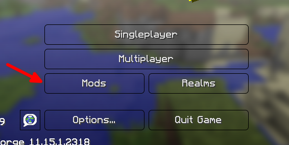
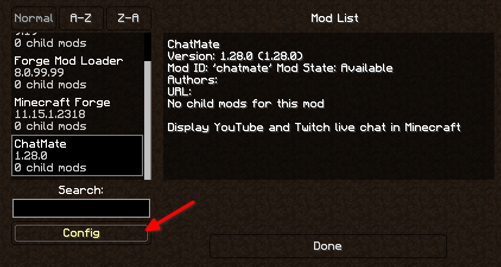
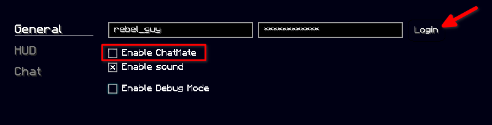

# Streamer Guide (Minecraft Mod)

This document is intended as a guide for streamers wishing to use ChatMate to enhance their streaming experience. For information on how to get started with ChatMate, refer to the generic [Streamer Guide](https://github.com/RebelGuy/chat-mate/blob/master/docs/streamer-guide.md).

## Getting set up

ChatMate offers a free Minecraft mod that integrates your livestream into Minecraft and allows you to perform administration tasks, such as banning users and managing ranks. **Currently, the mod runs only on Minecraft Java Edition 1.8.9 and has not been tested with other popular mods, such as LabyMod or Lunar Client.** You can download the mod [here](https://github.com/RebelGuy/chat-mate-client/releases/latest).

To start, ensure you have followed the [instructions for setting up your account and stream](https://github.com/RebelGuy/chat-mate/blob/master/docs/streamer-guide.md). Install Minecraft Forge, and place the ChatMate `.jar` into your `.minecraft/mods` folder. Open the ChatMate Dashboard within Minecraft to log in to your ChatMate account. Once logged in, you have access to streamer features.

You are now ready to go live and should see your livestream messages appear in your Minecraft chat window.

## Features

ChatMate offers a rich set of features and quality-of-life-improvements to Minecraft. Refer to the [Features](features.md) document for more info.
